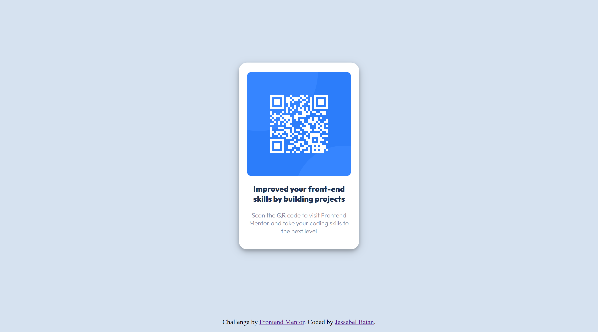
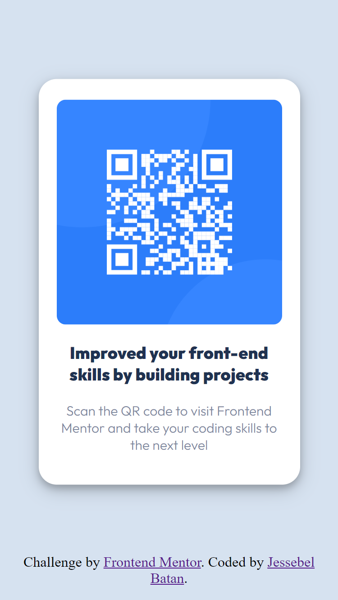

# Frontend Mentor - QR code component solution

This is a solution to the [QR code component challenge on Frontend Mentor](https://www.frontendmentor.io/challenges/qr-code-component-iux_sIO_H). Frontend Mentor challenges help you improve your coding skills by building realistic projects. 

## Table of contents

- [Overview](#overview)
  - [Screenshot](#screenshot)
- [My process](#my-process)
  - [Built with](#built-with)
  - [Continued development](#continued-development)
  - [Useful resources](#useful-resources)
- [Author](#author)
- [Acknowledgments](#acknowledgments)

## Overview

### Screenshot




## My process

### Built with

- HTML
- CSS

CSS Fonts

```CSS fonts
    @font-face {
      font-family: 'Outfit-Black';
      src: url('dist/static/Outfit-Black.ttf')
    }
    @font-face {
    font-family: 'Outfit-Light';
    src: url('dist/static/Outfit-Light.ttf')
    }
```
CSS Styles

```CSS styles
    body {
      background-color: hsl(212, 45%, 89%);
      text-align: center;
    }
    .card {
      background-color: hsl(0, 0%, 100%);
      width: 250px;
      display: flex;
      flex-direction: column;
      justify-content: center;
      position: absolute;
      top: 47%;
      left: 50%;
      transform: translate(-50%, -50%);
      padding: 20px;
      border-radius: 20px;
      box-shadow: 0 4px 8px 0 rgba(0, 0, 0, 0.2), 0 6px 20px 0 rgba(0, 0, 0, 0.19);
    }
    .card img {
      border-radius: 10px;
      margin-top: 3px;
      width: 100%;
    }
    h3 {
      font-family: Outfit-Black, Arial, sans-serif;
      color: hsl(218, 44%, 22%);
      font-weight: 700;
    }
    p {
      font-family: Outfit-Light, Arial, sans-serif;
      margin-top: 5%;
      color: hsl(220, 15%, 55%);
      font-weight: 400;
      font-size: 15px;
    }
    footer {
    position: absolute;
    bottom: 0;
    left: 0;
    right: 0;
    padding: 15px;
    text-align: center;
  }
```

### Continued development

As I take on my first challenge on Frontend Mentor, I aim to further develop my skills in CSS, as there is still much room for improvement.

### Useful resources

- [Resource 1](https://www.w3schools.com/) - This has been very helpful in improving my understanding of CSS, especially in areas where I'm unfamiliar with.

## Author

- Website - [Jessebel Batan](https://github.com/jisibil)
- Frontend Mentor - [@jisibil](https://www.frontendmentor.io/profile/jisibil)
- Twitter - [@yourusername](https://www.twitter.com/jisibil)

## Acknowledgments

I would like to thank Benjie Mondia (https://github.com/benjamineke) for introducing me Frontend Mentor and for answering all my questions wholeheartedly.

Challenge by [Frontend Mentor](https://www.frontendmentor.io?ref=challenge)
